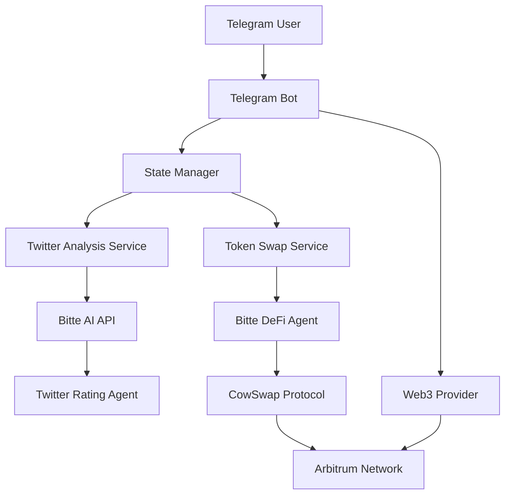

# Telegram Twitter Analysis & Token Swap Bot

A sophisticated Telegram bot that analyzes Twitter URLs using AI, awards users with USDC tokens based on analysis scores, and enables seamless token swapping through CowSwap protocol on Arbitrum network.

## 🚀 Features

- **Twitter URL Analysis**: Analyzes Twitter posts using Bitte AI API and provides scoring (1-10)
- **Token Rewards**: Awards USDC tokens based on analysis scores (score × 0.1 USDC)
- **Token Swapping**: Natural language token swapping via CowSwap integration
- **Multi-format Support**: Works in private chats, groups, and responds to mentions
- **Wallet Integration**: Web3 integration for real transaction execution
- **State Management**: User session and conversation state management

## 🏗️ Architecture

### Core Components

```
telegram_bitte_bot/
├── chatbot.py      # Main Telegram bot with complete functionality
├── final.py        # Advanced bot with CowSwap integration
├── swap.py         # Standalone CowSwap terminal interface
└── README.md       # This documentation
```

### System Architecture



## 📁 File Structure

### `chatbot.py` - Basic Twitter Analysis Bot
- **Purpose**: Core Telegram bot for Twitter analysis and token rewards
- **Features**: Twitter URL validation, AI analysis, mock token allocation
- **State Flow**: URL → Wallet → Analysis → Token Preference → Completion

### `final.py` - Advanced Bot with Real Swapping
- **Purpose**: Full-featured bot with actual CowSwap integration
- **Features**: Real wallet integration, natural language swap requests, transaction execution
- **State Flow**: URL → Wallet → Analysis → Swap Request → Confirmation → Execution

### `swap.py` - Standalone Terminal Interface  
- **Purpose**: Command-line interface for direct CowSwap interactions
- **Features**: Interactive chat, auto-execution, quick swap mode
- **Usage**: Direct API communication with Bitte DeFi agents

## 🔧 Technical Stack

### Backend Technologies
- **Python 3.8+**: Core programming language
- **python-telegram-bot**: Telegram Bot API wrapper
- **web3.py**: Ethereum blockchain interaction
- **aiohttp**: Async HTTP client for API calls
- **requests**: HTTP library for API communication

### External Services
- **Telegram Bot API**: Bot communication
- **Bitte AI API**: Twitter analysis and DeFi operations
- **CowSwap Protocol**: Decentralized exchange
- **Arbitrum Network**: Layer 2 Ethereum scaling

### Key Libraries
```python
telegram>=20.0
python-telegram-bot>=20.0
web3>=6.0.0
aiohttp>=3.8.0
requests>=2.28.0
```

## 🎯 User Flow

### Twitter Analysis Flow
1. **Initiation**: User sends `/start` command
2. **URL Input**: User provides Twitter URL
3. **Wallet Input**: User provides Ethereum wallet address
4. **Analysis**: Bot analyzes Twitter content via Bitte AI
5. **Scoring**: System returns score (1-10) and calculates USDC reward
6. **Token Options**: User specifies token allocation preferences

### Token Swap Flow (final.py)
1. **Swap Request**: Natural language swap instruction
2. **AI Processing**: Bitte DeFi agent processes request
3. **Quote Generation**: CowSwap generates swap quote
4. **Confirmation**: User confirms transaction
5. **Execution**: Web3 executes transaction on Arbitrum
6. **Completion**: Transaction hash and confirmation

## 🔐 Security Features

### Input Validation
- Twitter URL validation (twitter.com, x.com domains)
- Ethereum address validation (42 characters, 0x prefix)
- Transaction parameter validation

### State Management
- User session isolation
- Secure private key handling
- Chat history management per user

### Transaction Safety
- Gas estimation before execution
- Transaction confirmation waiting
- Error handling and rollback

## 🌐 API Integration

### Bitte AI Integration
```python
# Twitter Analysis Endpoint
POST https://ai-runtime-446257178793.europe-west1.run.app/chat
Agent: agent-rating.vercel.app

# DeFi Operations Endpoint  
POST https://ai-runtime-446257178793.europe-west1.run.app/chat
Agent: bitte-defi
```

### Response Format
```json
{
    "assistant_message": {
        "role": "assistant",
        "content": "Response text",
        "toolInvocations": [
            {
                "toolName": "swap",
                "result": {
                    "data": {
                        "tokenIn": {...},
                        "tokenOut": {...}
                    }
                }
            }
        ]
    }
}
```

## 🚀 Deployment

### Environment Variables
```bash
PRIVATE_KEY=your_ethereum_private_key
TELEGRAM_BOT_TOKEN=your_telegram_bot_token
BITTE_API_KEY=your_bitte_api_key
```

### Network Configuration
- **Chain**: Arbitrum One (Chain ID: 42161)
- **RPC**: https://arb1.arbitrum.io/rpc
- **Explorer**: https://arbiscan.io

### Installation
```bash
# Clone repository
git clone <repository-url>
cd telegram_bitte_bot

# Install dependencies
pip install -r requirements.txt

# Set environment variables
export PRIVATE_KEY="your_private_key"
export TELEGRAM_BOT_TOKEN="your_bot_token"

# Run the bot
python final.py
```

## 📊 State Management

### User States
```python
class UserState(Enum):
    WAITING_FOR_TWITTER_URL = "waiting_for_twitter_url"
    WAITING_FOR_WALLET_ADDRESS = "waiting_for_wallet_address"
    WAITING_FOR_SWAP_REQUEST = "waiting_for_swap_request"
    WAITING_FOR_SWAP_CONFIRMATION = "waiting_for_swap_confirmation"
    IDLE = "idle"
```

### Data Flow
- **User States**: Track conversation progress
- **User Data**: Store session information
- **Chat Histories**: Maintain conversation context with AI agents

## 🔄 Error Handling

### API Error Management
- Timeout handling for external API calls
- Retry logic for failed requests
- Graceful degradation for service unavailability

### Transaction Error Handling
- Gas estimation failures
- Network congestion handling
- Transaction confirmation timeouts
- User-friendly error messages

## 📈 Monitoring & Logging

### Logging Strategy
```python
logging.basicConfig(
    format='%(asctime)s - %(name)s - %(levelname)s - %(message)s',
    level=logging.INFO
)
```

### Key Metrics
- User interaction patterns
- API response times
- Transaction success rates
- Error frequency and types

## 🤝 Contributing

### Development Setup
1. Fork the repository
2. Create feature branch
3. Implement changes
4. Add tests if applicable
5. Submit pull request

### Code Style
- Follow PEP 8 guidelines
- Use type hints where applicable
- Document complex functions
- Maintain consistent error handling

## 📝 License

This project is part of a hackathon submission and is provided as-is for educational and demonstration purposes.

## 🔗 Links

- [Telegram Bot API](https://core.telegram.org/bots/api)
- [Bitte AI Platform](https://bitte.ai)
- [CowSwap Protocol](https://cow.fi)
- [Arbitrum Network](https://arbitrum.io)